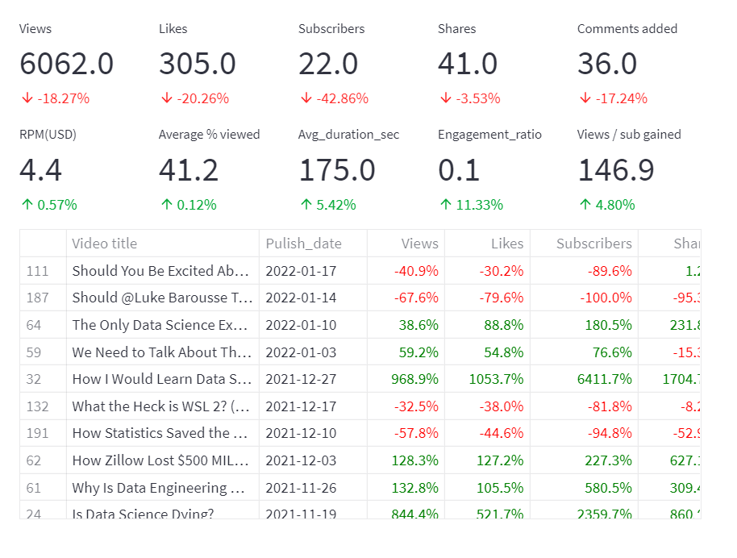
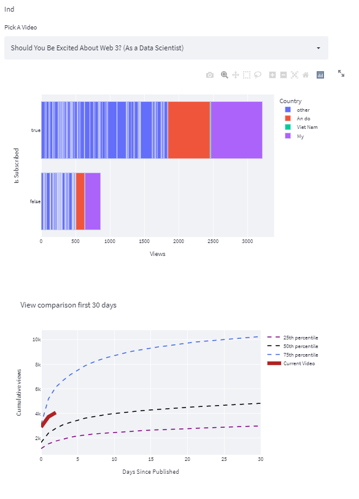

I BUILD A WEBSITE SO GO IN THERE IN HERE DOESNT HAVE ANY THING :3

Click here: https://share.streamlit.io/phuocsimple/yt_dashboard/main/python.py

<!--more-->
# YT_dashboard
## Overview

Developed an impactful dashboards website using data from Kaggle transform raw data into meaningful data to identify which Videos and Individual Video shows are performed good help YouTubers know which is the best stragegy for the next video hence increasing the quality of the channel

## Target

Using kaggle dataset about youtube viewer,subscriber,.. to create website dashboard help Youtubers know which video is perform good and not 

## Links

Website dashboard links : https://share.streamlit.io/phuocsimple/yt_dashboard/main/python.py

kaggle dataset links : https://www.kaggle.com/datasets/kenjee/ken-jee-youtube-data

any questions: https://www.facebook.com/phuocvuiver/

# Here is some picture in my website 

## All Videos

## Individual Video Analysis

